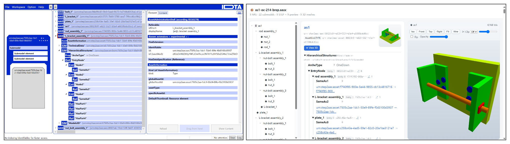

# STP2AAS

STEP (ISO 10303) CAD models → Asset Administration Shell (AAS) digital twin packages (.aasx).



CAx-IF AS1 (AP214): [AASX Package Explorer](https://github.com/eclipse-aaspe/package-explorer) on the left,
STP2AAS HTML viewer on the right. Converted with `--assembly-structure hierarchical --view`.

## Setup (self-contained — everything in this one folder)

`pythonocc-core` is not pip-installable, so the runtime is a conda env. Running
**`setup.bat`** builds that env **inside this folder at `.\env`** (installing
Miniforge via winget first if conda is missing). Code + environment then live
together in one folder; the `.bat` launchers call `.\env\python.exe` directly with
`PYTHONPATH=src`, so nothing is hardcoded and no `conda activate` is needed.

```
setup.bat                                 :: one-time; builds .\env from environment.yml
run_gui.bat                               :: launch the desktop GUI (pick a file, convert, view)
run.bat  input.stp -o out\model.aasx      :: CLI
view.bat out\model.aasx --open            :: build + open the 3D viewer
```

Moving to another PC: copy the folder and run `setup.bat` once (it rebuilds `.\env`;
needs internet). `.\env` is git-ignored and not committed.

## GUI

`run_gui.bat` (or `python scripts/gui.py`) opens a window to choose an input
STEP/AP242 file, convert it to `.aasx`, and open the interactive 3D viewer — the
same pipeline as the CLI, no commands needed.

## Usage (CLI)

STP2X3D-style flags (`--input`/`--output`; short `-i`/`-o`). `--output` is optional
and defaults to `<input>.aasx` beside the input. Bare positional forms also work.

```
run.bat --input <file> [--output <file.aasx>] [options]
python -m step2aas -i <file> [-o <file.aasx>] [options]
```

Inputs:
- **Part 21 STEP** (`.stp` / `.step`) — AP203 / AP214 / AP242, single part or assembly.
- **AP242 Domain Model XML** (`.stpx` / `.xml`) — CAx-IF/MBx-IF Assembly Structure BOM,
  both all-in-one and nested (multi-file sub-assembly) layouts. Referenced external
  STEP part files are resolved relative to the XML.

Options:
- `--assembly-structure {hierarchical,flat,single}` — AAS composition (default `hierarchical`):
  - `hierarchical` — one AAS per unique part **and** per unique sub-assembly; each
    assembly's 02011 BOM lists its direct children (`ArcheType=OneDown`) and
    identifies their assets through each Node's `globalAssetId`.
  - `flat` — one assembly AAS (root) + one AAS per unique part; the root BOM nests the
    whole tree (`ArcheType=Full`), nested sub-assemblies appear as co-managed BOM nodes.
  - `single` — one AAS for the whole model (all parts as Model3D entries + a co-managed
    `Full` BOM tree); experimental comparison baseline.

  The root `globalAssetId` is identical across modes (same physical asset), while root
  AAS/submodel ids differ per mode — outputs of several modes for the same file can be
  loaded into one repository side by side. Part AAS are shared between hierarchical/flat.
- `--link-only` — do not embed the original whole-model file (DigitalFile holds its
  path). Split per-part STEP files are still embedded.
- `--include-partial-nameplate` — emit the intentionally-incomplete 02006 Nameplate
  (default: omit, per policy D7).
- `--view` — also build the HTML 3D viewer next to the `.aasx`.
- `--open` — open that viewer in a browser (implies `--view`).
- `--no-3d` — with `--view`, build the viewer without 3D geometry (structure only; faster).
- `--derive-lightweight` — *reserved* (future work §6a; raises NotImplementedError).
- `-v/--verbose` — verbose logging (shows gap/fallback decisions).

Examples:
```
python -m step2aas --input tests/as1/as1_root.stp -o out/as1.aasx --view
python -m step2aas assembly.stp -o out/assembly.aasx --view
python -m step2aas Torque_Convertor_Assy.stpx -o out/converter.aasx --open
```

## What it produces

- Default **hierarchical** composition: one AAS per unique part **and** per unique
  sub-assembly. Each assembly's 02011 BOM (`ArcheType=OneDown`) identifies its
  direct child assets through `globalAssetId`. `--assembly-structure flat` restores a single root assembly AAS
  plus part AAS (nested sub-assemblies as co-managed BOM nodes). `--assembly-structure
  single` packs the whole model into one AAS.
- Repeated parts collapse to a single AAS referenced by multiple BOM Nodes (design decision D2).
- The original STEP is embedded per part as an AASX supplementary file; a 512² preview PNG is
  rendered offscreen (solid-colour placeholder fallback on headless GL failure, D6).

## Downstream use (why a Type AAS from CAD)

The converter emits **design-time Type AAS**, not a live factory twin. That is the
join point, not a dead end:

- A **line / plant AAS** could use an explicit production-assignment reference to
  identify the product type a station is building.
- An **instance AAS** can keep live data and use `derivedFrom` to reference the type
  AAS; `assetType` can identify its type asset. Consumers and discovery services must
  implement lookup; type and instance are distinct assets.
- **Suppliers** could publish part AAS for OEM BOM lookup after shared catalogue
  identities and discovery have been established.

See `docs/mapping-draft.md` §0.1 and §9 for downstream scenarios.
`scripts/demo_basyx.py` is a minimal upload/print demo.

Review status (2026-09-07): optional `SameAs` relationships are omitted; `HasPart`
uses Entity model references and self-managed Nodes use `globalAssetId` for asset
lookup. XML v2 includes resolved dependency content and relative-path namespaces
in identity. This intentionally changes prior XML IDs; P21 identity is unchanged.
See `docs/identity-policy.md` for migration and coverage.

Each package includes a custom `ConversionProvenance` JSON record (source hashes,
tool versions, mode, extraction coverage). Assembly volume/area is omitted when
any descendant lacks that property. The root `mapping/*.yaml` remains canonical
and is copied into the wheel during the build.

`scripts/validate_package.py package.aasx --xsd path/to/AAS.xsd --output report.json`
checks XML with a supplied official schema and independently inspects selected
references, entity kinds, lists, and embedded files. It does not certify every
IDTA template constraint.


## Visualization

Render an `.aasx` to a self-contained HTML viewer — AAS structure tree + BOM +
TechnicalData + preview thumbnails on one side, and an **interactive WebGL 3D
viewport** (geometry tessellated from the embedded STEP with pythonocc) on the
other. No server, no third-party JS; open the `.html` in any browser.

```
view.bat out\suspension.aasx --open       # build + open (click a part to load its 3D)
view.bat out\part.aasx --no-3d            # structure only (faster)
python -m step2aas.viewer out\x.aasx      # equivalent module form
```

## Testing

```
pytest -x -q
```

Roundtrip tests convert an in-memory IR (and optional fixtures), reload the `.aasx`
with basyx, and assert submodels, semanticIds, and BOM cardinality. Drop STEP/AP242
datasets under `tests/` (gitignored) to exercise real-world models; AP242 tests skip
when none are present. Coverage/size/time CSV: `python scripts/evaluate.py --synthetic`.

The public CAx-IF AS1 sample used in the screenshot is `tests/as1/as1_root.stp`.

## Data

- **AS1** is a public AP214 sample (CAx-IF). A copy lives at `tests/as1/as1_root.stp`.
- **Fusion 360 Gallery** assembly STEP files are **not** redistributed here (dataset
  license is non-commercial research). To reproduce the corpus sweep locally, place
  the Gallery archives on disk and run `scripts/download_fusion.py`,
  `scripts/extract_fusion.py`, and `scripts/run_fusion_experiment.py`.
- Conversion outputs (`.aasx`, HTML viewers, CSVs) stay under `out/` and are gitignored.

## Docs
- `docs/mapping-draft.md` — STEP ↔ IDTA submodel mapping specification (authoritative)
- `docs/identity-policy.md` — identifier scheme and XML v2 migration
- `docs/verification-log.md` — semanticId verification status + extraction/AP242 validation

## Author

**Soonjo Kwon** — School of Mechanical Engineering, Pusan National University,
Busan, Republic of Korea ([soonjo.kwon@pusan.ac.kr](mailto:soonjo.kwon@pusan.ac.kr)).

Released under the MIT License (`LICENSE`).
